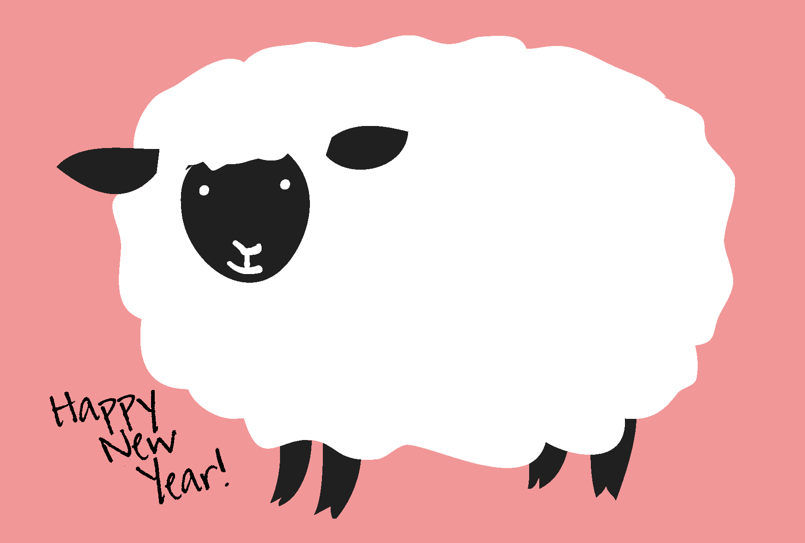

<!--
_paginate: false
-->
# クレールという女
P287 L8
~
P288 L3

---
# 流れ
1. 大事そうなこと
2. 本文
3. 本文要約
4. 細かいところ
5. 考えたこと？

---
# 「人間のしるし」とは
前の段落に出てきた本のこと

簡単にまとめると
戦争に反対して抵抗運動に参加する女性の話

---
# 大事なこと
- この部分が以下の二つの部分で
  構成されているということ
  1. 「人間のしるし」の魅力
  2.  なぜ「人間のしるし」の存在が大きいのか

---
# 大事なのはどっち？
1. 「人間のしるし」の魅力
2. ##### **なぜ「人間のしるし」の存在が大きいのか  ＜---**

---
<!--
/_header: ""
-->

# 本文 Part1

『人間のしるし』が、わたしたちをとりこにした第一の理由は、それが抵抗運動について書かれたものだからだ。数年の違いで、戦争を経験していなかった私たちは大人に盲従し戦争に参加した。その同じ時代に、ヨーロッパでは、多くの市民が人間らしさを大切にするために、抵抗運動に参加したことを戦争の後に知って、戦争を受け身で生きてしまった自分達の精神の貧さに愕然とした。

---
<!--
_footer: "抵抗運動は第二次世界大戦中にヨーロッパで行われた戦争に反対する活動のこと"
-->
# 本文 Part1 要約
- 「私たち」は何も考えずに戦争に参加していた
- 「人間のしるし」は抵抗運動について書かれていた
- 「人間のしるし」を読んで自分達の行動を振り返り、愕然とした

---
<!--
//backgroundColor: #405930
-->
# 本文 Part2
でも、この小説が抵抗運動についてだけ書かれた物だったら、多分、あれほどわたしたちを興奮させはしなかっただろう。目の覚める思いであの本を読んだのは、そこに「人間らしく生きる」とは何かという問題が、根本のところで提示されているように思えたからだった。

---
# 本文 Part2 要約
- 「人間のしるし」には抵抗運動以外のことも書かれている
- 「人間のしるし」の根本には「人間らしく生きる」とは何かという問題がある
- 私たちにとって「人間のしるし」はすごい本

---
# 現代文っぽいところ
> 私たちを虜にした第一の理由は
###### とあるのは、**第一**という語を使うことで他にも理由があるということを示している。また、

---
<!--
_paginate: none
-->
> 羊のように盲従し、メダカみたいに列を作って
###### とあるが、これは比喩表現である。

---
# 語彙
- 唯々諾々と
  - 他人の言うことにはいはいと従う様
  - 「唯」は「はい」、諾は「承諾の諾」なので**はいはいわかりました**と言う感じ
- 愕然とする
  - 主にネガティブなことに対して大変な驚きを意味する
  - ようするにびっくりすること

---
##### 考えたこと
- この人は戦争に参加してしまった理由を自身の精神が貧しかったからだと考えているのだろう
- また、精神を豊かにするためには人間らしく生きることが必要だと考えたのだろう